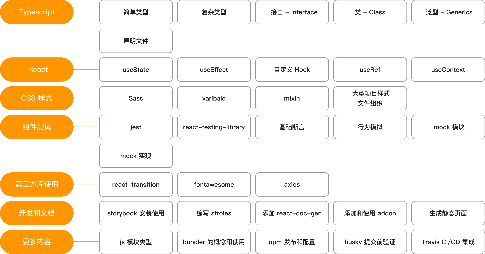
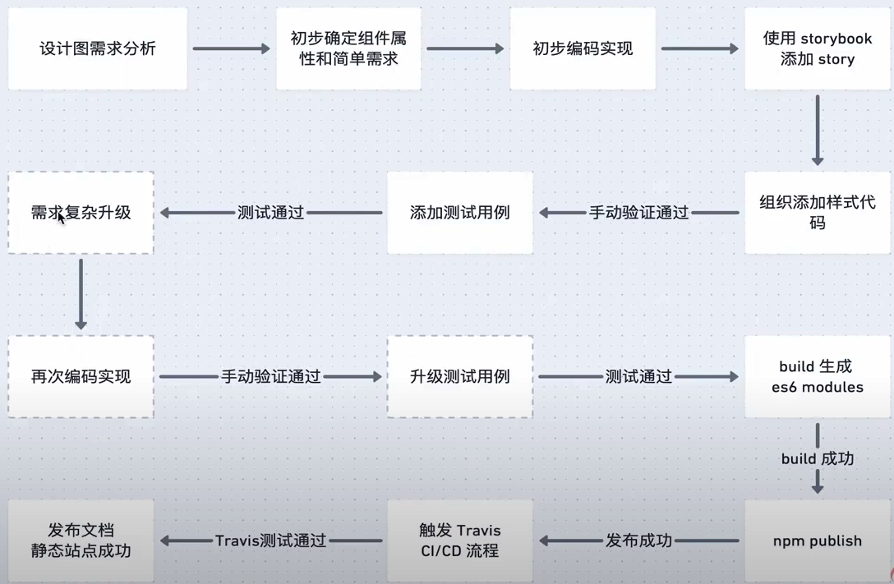

# React+TypeScript高仿AntDesign开发企业级UI组件库
- [React+TypeScript高仿AntDesign开发企业级UI组件库-慕课网](https://coding.imooc.com/class/428.html)
  
  - [Online Demo](http://vikingship.xyz/)

  - [Youtube]https://www.youtube.com/watch?v=q-llQ8H3EAQ&list=PL5LP0EWDTG3jFHfn7sl6hZTp8p-aRPJ0N

## 组件开发流程

## Key points

- Typescript

- React Hooks

- Component Dev

  - Project Structure
    
  - Test
    - Jest , react-testing-library
    - mock

  - CSS
    - Sass
    - variable ,mixin, function
    - Css file organization in big project

  - 3rd Party Libs
    - react-transition
    - fontawasome
    - axios

  - Documents
    - StoryBook－高效有组织的构建UI
    - Create stories
    - react-doc-gen
    - addon
    - static html page

  - CI/CD
    - Husky validation before submit
    - Travis CI/CD
## Missed
- 4-8, 4-10
- 5-5
- 6-1, 6-2, 6-7, 6-11
- 7-1, 7-6, 7-7, 7-8
- 8-1, 8-3, 8-8

- 12-1, 12-5
