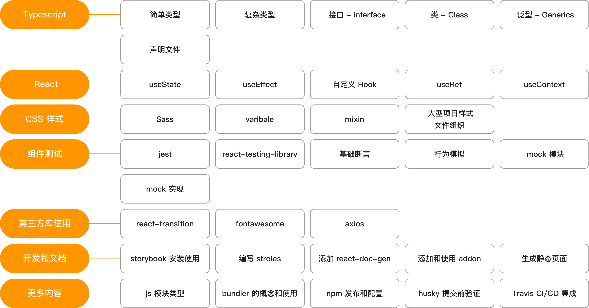

# React+TypeScript高仿AntDesign开发企业级UI组件库
- [React+TypeScript高仿AntDesign开发企业级UI组件库-慕课网](https://coding.imooc.com/class/428.html)
- https://www.youtube.com/watch?v=q-llQ8H3EAQ&list=PL5LP0EWDTG3jFHfn7sl6hZTp8p-aRPJ0N
- [基于实例的 React16 傻瓜课程](https://www.imooc.com/learn/1045)
- [从零打造TypeScript版React组件库之树形组件](http://www.zhufengpeixun.cn/zhufenggongkaike/gaojijiagougongkaike/2019-10-24/1231.html)

## Key points

## 组件开发流程

### Typescript
- type
- interface
- class
- Generics

### React Hooks
- userState
- useEffect
- useRef
- useContext
- Customized Hook

### Test
- Jest , react-testing-library
- mock

### CSS
- Sass
- variable ,mixin, function
- Css file organization in big project

## 3rd Party Libs
- react-transition
- fontawasome
- axios

### Documents
- StoryBook－高效有组织的构建UI
- Create stories
- react-doc-gen - 根据代码注释生成文档
- addon
- static html page

## CI/CD
- Husky: run testing validation before submit
- Travis: CI/CD 集成

## Missed
- 2-10, 2-12, 2-14
- 3-3, 3-8, 3-9, 3-12
- 4-3, 4-8, 4-10
- 5-5
- 6-1, 6-2, 6-7, 6-11
- 7-1, 7-6, 7-7, 7-8
- 8-1, 8-3, 8-8
