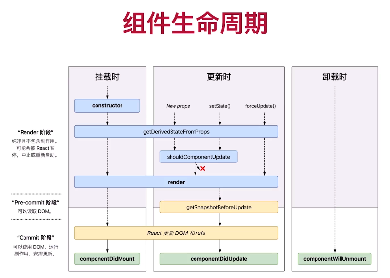

## 

## React life cycle

- Sample: DigitalClock

## React Hook (React 16.8)
### State hook: useState

### Effect hook
- What is side effects: 
Side effects are basically anything that affects something outside of the scope of the current function that’s being executed. That includes: API requests, Error tracking

### Customized hook