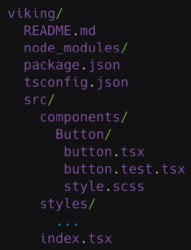

## React component development process


## Project structure



## Coding standard
Using eslint, add settings in .vscode/settings.json (https://create-react-app.dev/docs/setting-up-your-editor)
```

```


## Styles system
- Color system
- Font system: header, body, link
- Form: input
- Button
- Border, shadow


```
  npm i node-sass -S

  npx node-sass styles/index.scss  index.css      # complie scss

  npx node-sass styles/_variableds.scss  vaer.css      # complie parital file start with "_" will create empty file
```
- Process classname
```
    "classnames":"^2.2.6",
    "@types/classnames":"^2.2.10"
```

## Unit Test
```
  npm i jest -D
  npm i @testing-library/react -D        # replace Enzyme
  npm i @testing-library/jest-dom -D     # assert to DOM

  npx jest myApp.test.js --watch     # Run test
```