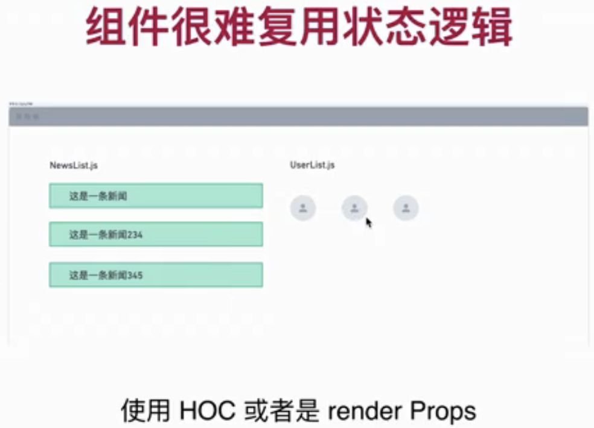
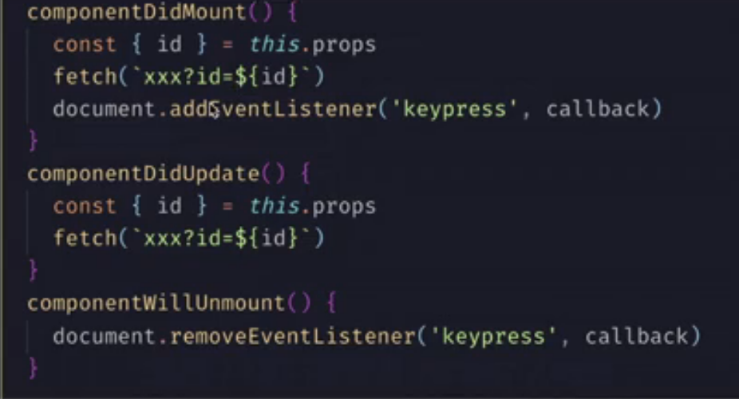

## 第3章 神奇的 React 配合 typescript，完美输出
本章回顾了 React 的基础知识，从而引出了全新的 React Hooks，配合上一章typescript的基础知识，详细讲解了 useState, useEffect, 自定义Hook，useContext 和 useRef 等基础知识，为组件库的开发打下坚实基础。

- 3-1 React简介和基础知识回顾

- 3-2 配置 react 开发环境

- 3-3 第一个组件 – ts为组件助力

- 3-4 什么是 和 为什么要使用 React Hook

  React 16.8  提供 Hook 

  React compnent 复用状态逻辑需要使用HOC或render Props, hooks可以提取状态逻辑，方便复用，测试
  


  React class compnent 的事件会把不相关的代码混在一起, hooks可以把代码拆分成更小的块
  

  React Component 一直是函数，使用 Hook 完全拥抱函数

- 3-5 在函数组件使用 state – useState Hook

- 3-6 useEffect 第一部分 – 初出茅庐

  What is side effects: 
  Side effects are basically anything that affects something outside of the scope of the current function that’s being executed. That includes: API requests, Error tracking


  本节展示 无需清除的Effect，比如加载数据

  在Class component中 会出现重复的代码
  ```
    componentDidMount(){

    }

    componentDidUpdate(){

    }
  ```

  useEffect 的使用
  ```
    useEffect(callback: EffectCallback, []) 

    callback可以返回void或一个function
  ```
  Reac会在特定时机调用这个callback

  React 默认是在每次render后都调用callback

- 3-7 useEffect 第二部分 – 有始有终
  本节展示 无需清除的Effect，比addEventListener，removeEventListener
  在Class component
  ```
    componentDidMount(){
      document.addEventListener()
    }

    componentWillUnmount(){
      document.removeEventListener()
    }
  ```
  下面代码演示一个useEffec常见错误
  ```
  const useMousePositon = () => {
    const [pos, setPos] = useState({ x: 0, y: 0 });

    useEffect(() => {
      const updatePos = (e: MouseEvent) => {
        console.log("upate pos");  // 会被多次重复调用
        setPos({ x: e.clientX, y: e.clientY });
      };
      // 每次刷新都会再次addEventListener
      document.addEventListener("mousemove", updatePos);
    });

    return(
      <p> {pos.x}, {pox.y}</p>;
    )
  };

  ```
  正确的做法是
  ```
  const useMousePositon = () => {
    const [pos, setPos] = useState({ x: 0, y: 0 });

    useEffect(() => {
      console.log('add Effect', pos.x)
      const updatePos = (e: MouseEvent) => {
        console.log("inner");
        setPos({ x: e.clientX, y: e.clientY });
      };
      document.addEventListener("mousemove", updatePos);
      // 每次执行Effect前会clean前一个Effect
      return () => {
        console.log('add Effect', pos.x);  // print last pos.x
        document.removeEventListener("mousemove", updatePos);
      };
    }, []);
    console.log("before render");
    return(
      <p> {pos.x}, {pox.y}</p>;
    )
  };
  ```
  React会在每次执行Effect前清除前一个Effect，调用从callback函数返回的函数, 这个例子可以验证清除Effect的时机

- 3-8 useEffect 第三部分 – 控制运行
  通知React不要在每次渲染都执行Effect

  Only first loading
  ```
    useEffect( ()=>{dothing...}, [] )
  ```

  When data change
  ```
    useEffect( ()=>{dothing...}, [data] )
  ```


- 3-9 自定义 Hook – 重构 MouseTracker
  复用状态逻辑

  利用Hook可以把逻辑抽取到一个可复用的function中
  比如， useMousePositon 

  每个对hook的调用，其中的state都是隔离的

  比如，可以把useMousePositon 复用到 Button组件和App组件中

- 3-10 自定义 Hook 第二部分 – HOC的劣势
  本节要实现一个显示数据加载状态的组件

  HOC本质上是一个函数，接受一个Component做参数，返回一个新的组件
  sample: App-HOC

  HOC的缺点是 被wrapped的组件需要之道HOC的数据结构

- 3-11 自定义 hook 第三部分 – 正确的方式完成 URLLoader
  把数据加载逻辑封装到一个 cutomize hook中
  sample: App-hook-loader

- 3-12 useRef – state遇到的难题
  注意，每次渲染，state都是独立的

- 3-13 useRef – 多次渲染之间的纽带
  sample : App-useRef-2

  
- 3-14 useContext – 解决多层传递属性的灵丹妙药
  只要被provider 包裹的子组件，都可以访问context
  sample: APP-context

  
- 3-15 hook 规则和其他 hook
只在最顶层使用 Hook

只在React函数中使用 Hook

可以在Hook中调用Hook

