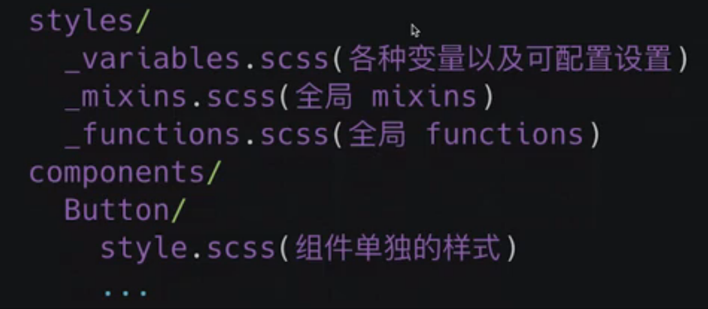
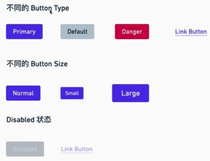
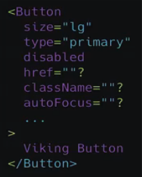

## 第4章 组件库起航 – 你真的能写的好看起来简单的 Button 组件吗？
本章正式进入组件库的编写，前半部分规定了文件结构和代码规范，分析了样式解决方案，添加了一系列样式的基础元素，后半部分渐进式的完成了 Button 组件的编码工作。

- 4-1 组件库开始起航 – 需求分析

- 4-2 文件结构和代码规范
  


- 4-3 样式解决方案分析
  

- 4-4 做一次设计师 – 添加自己的色彩体系
  
  系统色彩 = 基础色板 + 中性色板 
  产品色板 = 品牌色(Pirmary, Second) + 功能色板(信息，状态：成功，失败，危险, 提醒...) 


  Support Sass in react-script project
  ```
    npm i node-sass 
  ```

  在 _variables.scss 定义中性色彩, 基础色板, 
  !default 是sass 提供的特性，如果用户定义了同名变量，被!default 修饰的变量的值会被用户定义的值覆盖


- 4-5 更多样式变量 – 添加字体变量解决方案
  组件样式库变量分类
  - 基础色彩
  - 字体系统
  - Form
  - Button
  - Border， shadow
  - 可配置开关

  Font
    - Font family
    - Font size
    - Font weight
    - Line Height
    - H

  Link

  Body

- 4-6 初次亮相 – 添加 normalize.css
  有些默认样式 margin, padding 在不同浏览器中不统一  
  
  第一步：定义 dom 在浏览器中的默认样式。
  normalize.css 提供了跨浏览器一致性。
  _reboot.scss 是normalize.css的scss版本，并用_variables.scss 中的变量进行了替换


  第二步：在index.scss中 导出 定义好的样式

  注意 sass 中partial 文件以 _开头，index.scss 中导入的文件名不加 _

  实验
  ```
    npx node-sass _variables.scss var.css
  ```
  partial 文件不会被编译成css

  在index.tsx中引入 index.scss
  ```
  import "./styles/index.scss";
  ```
  Sample : App-html  which demonstrate the _reboot.scss

- 4-7 Button 组件需求分析
  
  
  注意： Normal button 对应的 Html tag is <bttton>, which has disable attribute.
  LinkButton 对应的 Html tag is <A>, <A> doesn't have disalbed attribute, we need use css to disable link button
  
  
  
- 4-8 小试牛刀 – Button 组件编码 第一部分

- 4-9 添加 Button 基本样式

- 4-10 升级 Button 组件样式

- 4-11 精益求精 – Buton 组件编码第二部分 试看

- 4-12 完成 Alert 组件