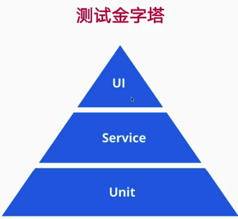

##  第5章 组件测试
本章从什么是测试入手，简介了测试的基本概念，介绍通用测试工具 Jest 和 React 测试框架 react-testing-library，
然后使用这两种工具完成Button组件的单元测试。

- 5-1 为什么要有测试
  - 更早发现bug

  - refactor, update

  - 开发流程自动化

  

  React 适合测试的特点
    - component
    - Function
    - 单向数据流
  
- 5-2 通用测试框架 Jest 出场
  create-react-app 默认已经安装 Jest

  ```
    npm i -D Jest 

    npx jest test.js --watch
  ```
  toBe: 同一个引用
  toEqual:  值相等
  
- 5-3 React 测试工具 – react-testing-library
  ```
  npm i -D @testing-library/react
  ```

- 5-4 添加Button 测试代码 第一部分
  render React Component

  create-react-app 默认已经安装 jest-dom 
  ```
  npm i -D @testing-library/jest-dom   # 
  ```
  jest-dom 增加断言 toBe***

  need setupTests.ts
  ```
  import '@testing-library/jest-dom/extend-expect'
  ```
  - test props
  - test class

  sample: button.test.tsx

- 5-5 添加Button 测试代码 第二部分
  Mock function
  ```
  fireEvent.click(element);
  expect(defaultProps.onClick).toHaveBeenCalled();
  ```

- 5-6 Alert 组件添加测试用例
