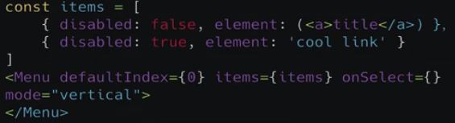
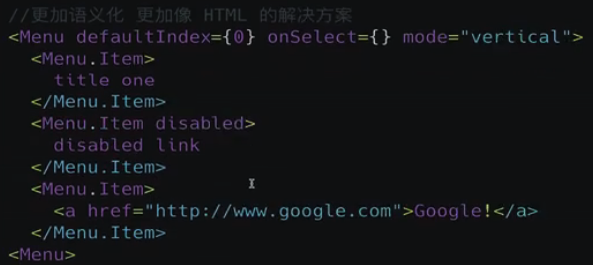
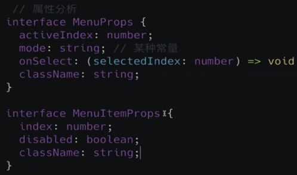

##  第6章 更上一层楼 – 完成 Menu 组件
本章在前两章的基础上，更上一层楼，完成Menu 组件，从需求分析，到组件编码，到再次分析需求，到再次完成编码，最后完成组件的所有单元测试。

- 6-1 Menu 组件需求分析

  - 顶部Nav or Side Nav
  - Sub-menu
  - Active Item

  
  
  
  
- 6-2 基础架构 – Menu组件编码第一部分
  ```
  type MenuMode = 'horizontal' | 'vertical'
  type SelectCallback = (selectedIndex: string) => void;

  export interface MenuProps {
    defaultIndex?: string;   // the active item
    className?: string;
    mode?: MenuMode;
    style?: CSSProperties;   // React type
    onSelect?: SelectCallback; 
    /**设置子菜单的默认打开 只在纵向模式下生效 */
    defaultOpenSubMenus?: string[];
  }
  ```
  There a two questions here:
   1. MenuItem need to know the active item index in Menu
   2. Menu need to pass onSelect handler to MenuItem
  


- 6-3 需求升级 – Menu 组件编码第二部分
  Use react context 
  ```
  interface IMenuContext {
    index: string;
    onSelect?: SelectCallback;
    mode?: MenuMode;
    defaultOpenSubMenus?: string[];
  }

  export const MenuContext = createContext<IMenuContext>({ index: '0' });
  ```
  In Menu component, we need a state to preserve the active item.
  ```
  const [currentActive, setActive] = useState(defaultIndex);

  const passedContext: IMenuContext = {
    index: currentActive ? currentActive : '0',
    onSelect: handleClick,
    mode,
    defaultOpenSubMenus,
  };

  <MenuContext.Provider value={passedContext}>
    {renderChildren()}
  </MenuContext.Provider>
  ```

  Use the context in MenuItem
  ```
  import { MenuContext } from './menu'

  const context = useContext(MenuContext);

  ```

- 6-4 添加 Menu 样式
- 6-5 测试驱动 – Menu 测试添加
- 6-6 日趋完美 – Menu 组件编码第三部分
- 6-7 功能继续升级 – SubMenu 下拉菜单编码第一部分
- 6-8 添加交互 – SubMenu下拉菜单编码第二部分
- 6-9 大功告成 – SubMenu 下拉菜单编码第三部分
- 6-10 完美组件 – SubMenu 组件添加测试
- 6-11 Tabs 组件