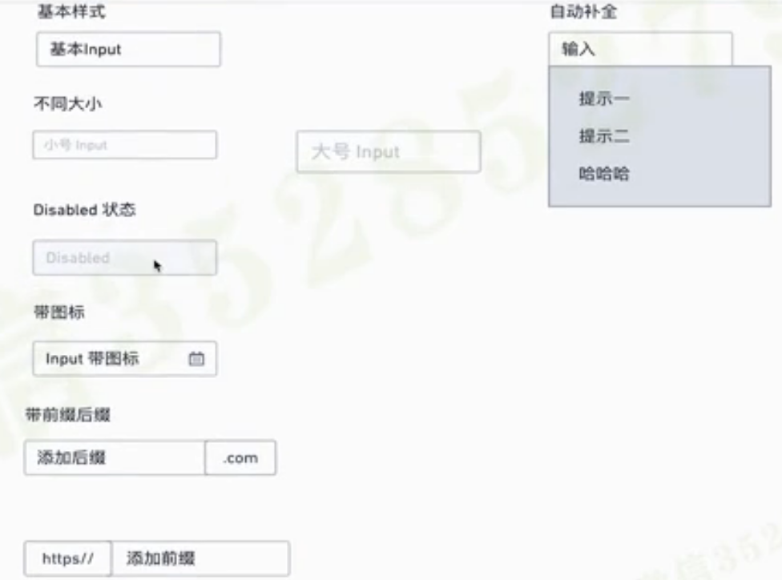
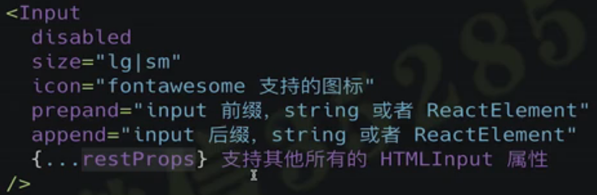

## 第9章 进入表单的世界 – Input 组件和 AutoComplete 组件
本章进入表单的世界，从简单组件 Input 入手，引出 AutoComplete 组件的分析和实现，在这个过程中，我们会学习 异步请求，函数防抖，键盘事件，useRef 等一系列功能。

- 9-1 知己知彼 -Input 组件需求分析 (06:09)
  
  
  step 1: 根据设计图分析属性
  
  Features
    - size
    - disable
    - icon
    - prefix / suffix
    - auto-complete

- 9-2 抛砖引玉 - Input 组件伪代码实现 (08:48)
  step 2: create component
  ```
    <Input
      disabled
      size="lg|sm"
      icon=""
      prepand="string or ReactElement"
      append="string or ReactElement"
      {...restProps}
    />
  ```
  
- 9-3 持续优化 - Input组件代码实现和优化过程 (12:11)
  create variable.scss, styles.scss

  create storybook

  create test

- 9-4 新的挑战 - AutoComplete组件分析 (09:29)

- 9-5 基本骨架 - AutoComplete 编码第一部分 (14:09)

- 9-6 AutoComplete 支持自定义模版 (11:21)

- 9-7 异步来了 - AutoComplete 支持异步请求编码 (09:42)

- 9-8 老瓶新酒 - 使用自定义Hook实现 函数防抖 (11:51)

- 9-9 AutoComplete 支持键盘事件 (10:11)

- 9-10 妙用 useRef - 实现 clickOutSide 功能- (10:57)

- 9-11 完美收尾 - AutoComplete 添加单元测试 (14:08)

- 9-12 Select 组件
