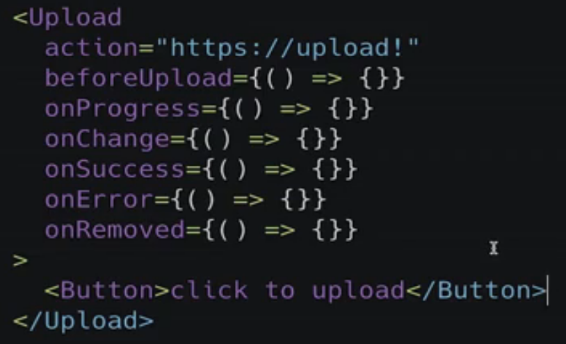

## 第10章 终极任务 – Upload 组件
本章实现了 Upload 组件从分析，编码，测试的全过程，在这个过程中，我们将会学到：使用 axios 发送异步请求，在线 mock server 的简单使用，HTTP 异步上传文件的基本知识，拖动文件上传怎样实现，异步和拖动怎样写单元测试。

- 10-1 最终任务 - Upload组件需求分析 (06:22)

  

  

  
  
- 10-2 下一代 HTTP 库 - axios (05:54)

  

  

  

  


- 10-3 在线 mock server 和 axios 简单使用 (09:29)
  - JSON Placeholder

  - Mocky.io

- 10-4 上传文件的基本方式 (09:39)
  1. Form submit
  ```
    <form methd="post" encType="multipart/form-data" action="https://"
  ```
   
  
  2. javaScript

  Sample: App-File-Upload.tsx

- 10-5 完成基本流程 - Upload 组件编码第一部分 (13:23)

  Hide the file input
  ```
    <input
      style={{display: 'none'}}
      ref={fileInput}
      onChange={handleFileChange}
      type="file"
      accept={accept}
      multiple={multiple}
    />
  ```

  Operate fileinput
  ```
    const handleClick = () => {
      if (fileInput.current) {
        fileInput.current.click()
      }
    }
  ```

- 10-6 完善生命周期 - Upload 组件编码第二部分 (08:00)

- 10-7 创建列表数据 - UploadList 组件编码第一部分 (13:36)

- 10-8 显示上传数据 - UploadList 组件编码第二部分 (11:59)

- 10-9 显示上传进度 - 添加 Progress 组件 (10:29)


- 10-10 精益求精 - 再次分析 Upload 组件更近一步需求 (06:33)
  

  
- 10-11 Upload 增强交互第一部分 (08:50)

- 10-12 拖动上传 - 支持 Drag and Drop (10:05)
  
  Get files
  ```
    const handleDrop = (e: DragEvent<HTMLElement>) => {
      e.preventDefault()
      setDragOver(false)
      onFile(e.dataTransfer.files)
    }
  ```  
- 10-13 异步怎样测试？ - Upload 测试第一部分 (12:29)
  Mock axios

  ```
    jest.mock('axios')

    const mockedAxios = axios as jest.Mocked<typeof axios>

    mockedAxios.post.mockImplementation(() => {
        return Promise.resolve({'data': 'cool'})
    })

    Or

    mockedAxios.post.mockResolvedValue({'data': 'cool'})
  ```

- 10-14 拖动事件怎样测试？ - Upload 测试第二部分 (11:20)

  
